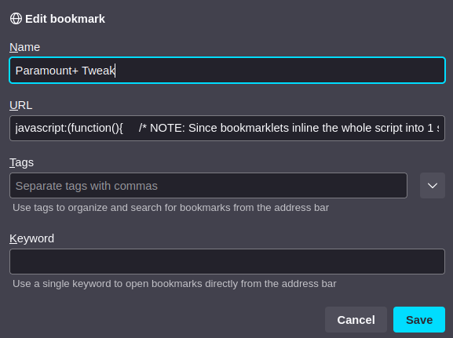

# video-player-tweaks
Tweaks to common video players to help usability

# How to use
* Create a bookmark in your browser of choice. Usually you can right-click the bookmark bar and say "new bookmark"
    * For the name, use whatever human-readable name you want
    * For the URL, instead copy-paste the entire file contents for a given script file from the `src/tweaks` folder into the URL entry. Don't worry that it looks like a single-line entry field and you're pasting in many lines. It'll work just fine.
    * Once the bookmark is there, wait for your page to load (let the video player fully load), and then click the bookmark ONCE.

# Current tweaks
* Removes any popovers/overlays that appear when you move your mouse or hit keys on the player. These are a hinderance to live TV watching. If you want them back, just hit refresh on the page and don't load the tweaks!
* Binds `spacebar` to play/pause on the video
* Binds arrow keys up/down to volume up/down
* Binds arrow keys left/right to seek -15s/+15s

# How to debug/edit
These helper scripts are MIT license, so you can edit them however you like.

## Paste/edit code in browser devtools
Open the browser debugging tools, and when pasting the script into the console, **omit the first and last lines** (the things that add the javascript: prefix and outer function definition).

This outer wrapping is required to make the bookmark bar treat the code you've entered as a javascript snippet instead of a URL. They won't work as pasted in the shell.

## Common tweaks
* Change a keycode to your preference. See defined keycodes for various operating systems (when different) at MDN [here](https://developer.mozilla.org/en-US/docs/Web/API/UI_Events/Keyboard_event_code_values)
* Combine multiple set of tweaks into one file/button. Right now this is not the default, but see the commented line at the top for how to do this based on the `window.location.host` variable.
* Add new compatibility for a new player! Thanks! Consider opening a pull request :-)
